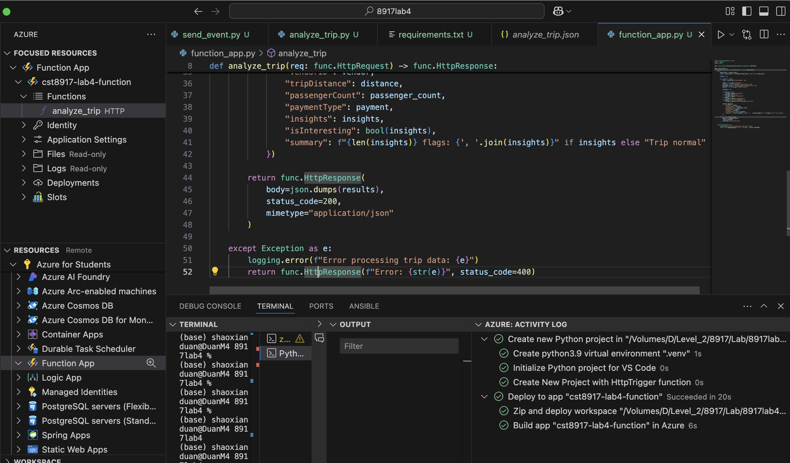
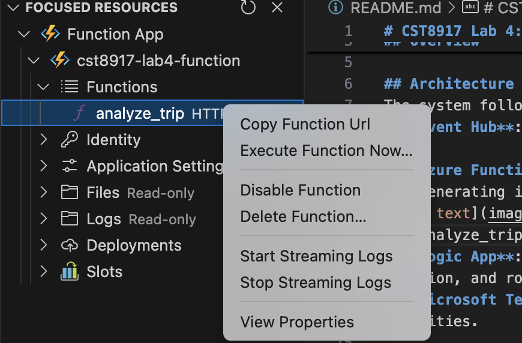
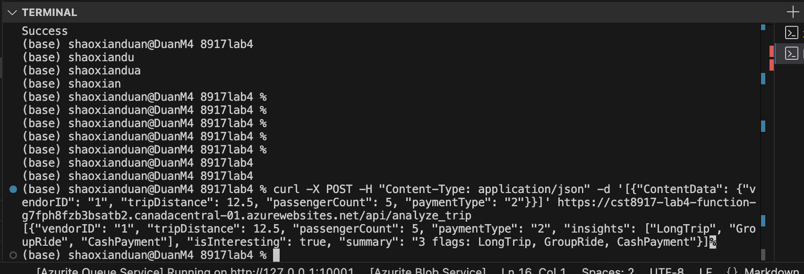

# CST8917 Lab 4: Real-Time Trip Event Analysis

## Overview
This project implements a real-time trip event analysis system for a taxi dispatch network, designed to monitor trip data and flag anomalies such as long trips, group rides, cash payments, or suspicious vendor activity. The system leverages Azure services to ingest, process, and alert operations staff via Microsoft Teams.

## Architecture
The system follows an event-driven architecture:
- **Event Hub**: `taxi-services-lab4` Namespace with `taximessagehub` ingests trip events in real-time.

- **Azure Function**: `cst8917-lab4-function` / `analyze_trip` processes each event, analyzing patterns and generating insights.

get analyze_trip's functions URL :

curl -X POST -H "Content-Type: application/json" -d '[{"ContentData": {"vendorID": "1", "tripDistance": 12.5, "passengerCount": 5, "paymentType": "2"}}]' https://cst8917-lab4-function-g7fph8fzb3bsatb2.canadacentral-01.azurewebsites.net/api/analyze_trip
[{"vendorID": "1", "tripDistance": 12.5, "passengerCount": 5, "paymentType": "2", "insights": ["LongTrip", "GroupRide", "CashPayment"], "isInteresting": true, "summary": "3 flags: LongTrip, GroupRide, CashPayment"}]% 

Success ：Indicates that the analyze_trip function has been successfully deployed and is running correctly, with the logic (long-distance trips, group rides, and cash payment detection) functioning as expected.
- **Logic App**: `cst8917-lab4-logicapp` orchestrates the workflow, triggering on events, calling the Function, and routing results to Teams.
- **Microsoft Teams**: Receives Adaptive Cards for normal trips, interesting trips, or suspicious activities.

## Function Logic
The `analyze_trip` Azure Function analyzes trip data with the following rules:
- **LongTrip**: Triggered if `tripDistance` > 10 miles.
- **GroupRide**: Triggered if `passengerCount` > 4.
- **CashPayment**: Triggered if `paymentType` = "2" (cash).
- **SuspiciousVendorActivity**: Triggered if `paymentType` = "2" and `tripDistance` < 1 mile.

The function returns a JSON response with:
- `vendorID`, `tripDistance`, `passengerCount`, `paymentType`.
- `insights`: List of detected flags.
- `isInteresting`: Boolean indicating if any flags are present.
- `summary`: Text summary of flags or "Trip normal".

## Example Input/Output
### Input
```json
[
  {
    "ContentData": {
      "vendorID": "1",
      "tripDistance": 12.5,
      "passengerCount": 5,
      "paymentType": "2"
    }
  },
  {
    "ContentData": {
      "vendorID": "2",
      "tripDistance": 0.5,
      "passengerCount": 1,
      "paymentType": "2"
    }
  }
]

by Shaoxian Duan