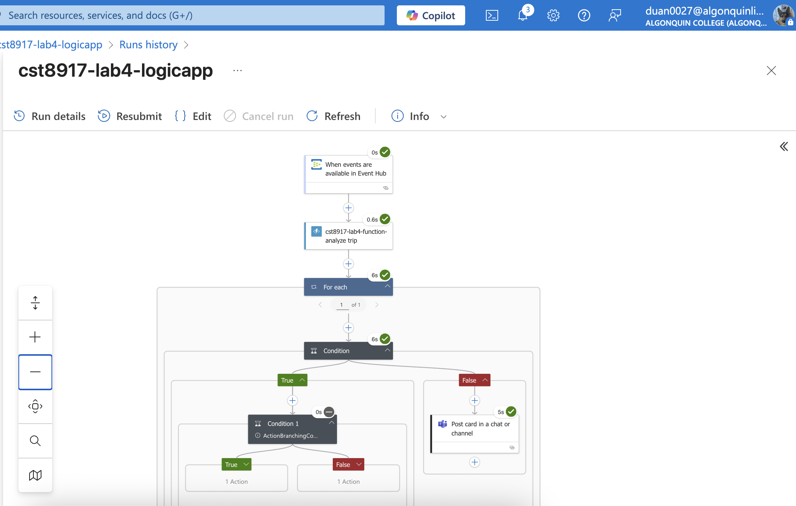
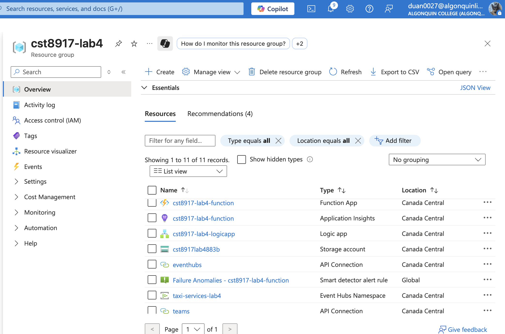
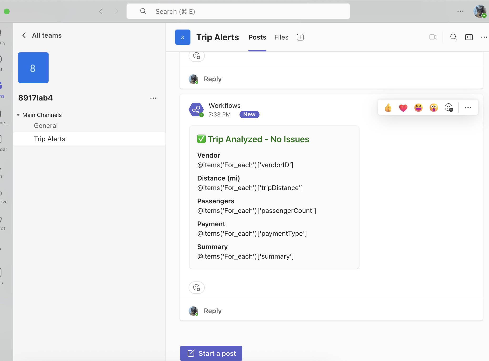

# 🚕 CST8917 Lab 4: Real-Time Trip Event Analysis

## 📌 Overview

This project implements a real-time **trip event analysis system** for a city-wide taxi dispatch network. It uses **Azure Event Hub**, **Azure Functions**, **Logic Apps**, and **Microsoft Teams** to detect and notify operations staff of trips with unusual patterns — such as long trips, group rides, cash payments, or suspicious short-distance activity.


## 🧱 Architecture

The system follows an **event-driven cloud architecture**:

```
Trip Event (JSON)
        ↓
Azure Event Hub (taximessagehub)
        ↓
Azure Function (analyze_trip)
        ↓
Azure Logic App (orchestrates logic)
        ↓
Microsoft Teams (Adaptive Cards notifications)
```


---

## 🧪 Function Logic

The `analyze_trip` Azure Function processes incoming trip data and flags patterns:

| Insight                  | Rule                                                           |
|--------------------------|----------------------------------------------------------------|
| `LongTrip`               | `tripDistance > 10`                                            |
| `GroupRide`              | `passengerCount > 4`                                           |
| `CashPayment`            | `paymentType == "2"`                                           |
| `SuspiciousVendorActivity` | `paymentType == "2"` **and** `tripDistance < 1`              |

## Example Input/Output
### Input
```json
[
  {
    "ContentData": {
      "vendorID": "1",
      "tripDistance": 12.5,
      "passengerCount": 5,
      "paymentType": "2"
    }
  },
  {
    "ContentData": {
      "vendorID": "2",
      "tripDistance": 0.5,
      "passengerCount": 1,
      "paymentType": "2"
    }
  }
]
```


---

## ⚙️ System Components

### 1. Event Hub
- **Namespace**: `taxi-services-lab4`
- **Hub Name**: `taximessagehub`
- Receives simulated trip event data in JSON format.

### 2. Azure Function: `analyze_trip`
- Triggered via HTTP (used by Logic App)
- Endpoint:  
  ```
  POST https://<your-function-app>.azurewebsites.net/api/
  ```
- Sample `curl`:
  ```bash
  curl -X POST -H "Content-Type: application/json" -d '[
    {
      "ContentData": {
        "vendorID": "1",
        "tripDistance": 12.5,
        "passengerCount": 5,
        "paymentType": "2"
      }
    }
  ]' 
  ```

### 3. Logic App
- Triggers on new Event Hub messages
- Calls `analyze_trip` Azure Function
- Uses `For each` loop to handle responses
- Posts appropriate Adaptive Cards to Teams

### 4. Microsoft Teams (Adaptive Cards)
- **Trip Normal Card**
- **Interesting Trip Card**
- **Suspicious Vendor Activity Card**

---

## 🎥 Demo Video

[▶️ Watch Demo on YouTube](https://your-video-link.com)

---

## ✍️ Author

**Shaoxian Duan**  

